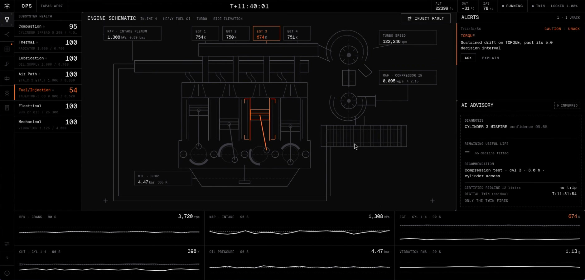
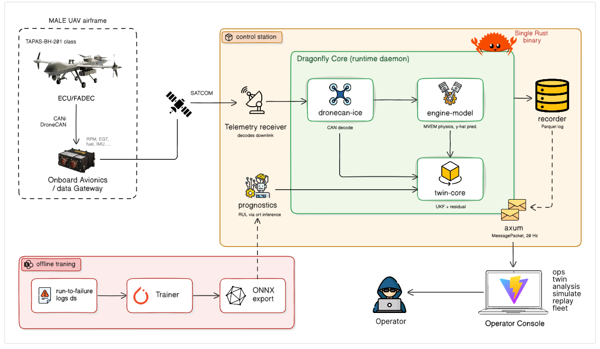
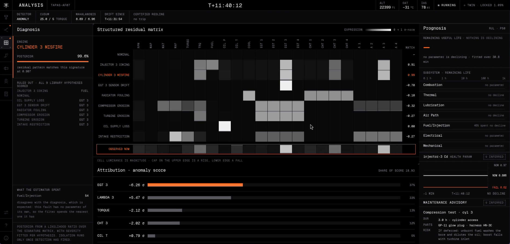
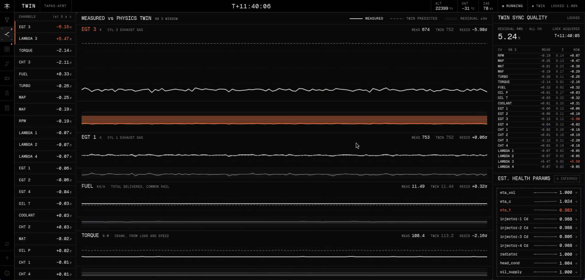

<h1 align="center">RQ-4 DRAGONFLY</h1>

<p align="center">
  <b>A real-time digital twin and health-monitoring ground station<br>for the piston engine of a MALE UAV.</b>
</p>

<p align="center">
  <i>It does not watch the sensors. It watches the residual.</i>
</p>

<p align="center">
  
  
  
  
</p>

<p align="center">
  <a href="https://dragonfly.vyse.site"><b>Site</b></a> ·
  <a href="https://gcs.dragonfly.vyse.site"><b>Live ground station</b></a> ·
  <a href="docs/model_validation.md"><b>Model validation</b></a> ·
  <a href="docs/fault_signatures.md"><b>Fault signatures</b></a>
</p>

<br>

Engine monitoring in service is a gauge and a redline, but faults don't start at the redline. A coking injector or a weak cylinder stays inside every limit for hours while it damages the engine, and the alarm sounds once the damage is done.

DRAGONFLY runs a physics model of the engine beside the real one and compares them. The difference between what the engine reads and what physics says it should read is the **residual**, and a fault shows up there long before any gauge moves. It's built for the piston engine of a medium-altitude long-endurance (MALE) unmanned aerial vehicle (UAV).

<p align="center">
  
  <br><sub>Cylinder 3 is failing. EGT 3 reads 674 K, inside its limit. Certified redline: no trip. Only the twin fired.</sub>
</p>

## Architecture

One Rust binary runs the whole ground-side pipeline, from decoding telemetry to serving the operator console.

<p align="center">
  
</p>

Telemetry arrives as DroneCAN frames on a Controller Area Network (CAN) interface. The twin runs against each frame, a recorder writes the mission to Parquet, and the operator console reads the result over a WebSocket. Python is used only for offline work and never runs in this path.


## How it works

Six layers turn raw telemetry into a named fault and a remaining-life estimate.

### 1. Engine model

The model is a mean-value model of the Austro Engine E4P (AE330): a 1,991 cm³, four-cylinder, turbocharged, heavy-fuel diesel. It covers manifold filling, a smoke-limited fuel map, turbocharger shaft dynamics, wastegate control, and per-cylinder combustion and thermal nodes.

The model is a pure function with no I/O, async or clock, so a whole mission can be projected forward in seconds. Every parameter lives in [`ae330.toml`](crates/engine-model/src/engines/ae330.toml) and is tagged `published` or `estimated`.

### 2. Telemetry bus

[`dronecan-ice`](crates/dronecan-ice) is a DroneCAN v0 codec for the reciprocating-engine message set, written from scratch and tested against vectors from the reference `pydronecan` encoder. The demo engine, `dragonfly-sim`, writes real frames to a virtual CAN interface (`vcan0`). Real hardware needs one change: point the ground station at `can0`.

### 3. Twin

A joint unscented Kalman filter (UKF) keeps the model locked to the measured engine. Its state holds the engine states, the lags of the slower instruments, and 10 slowly varying health parameters:

- Volumetric efficiency
- Compressor and turbine efficiency
- Injector flow for each cylinder
- Radiator effectiveness, head conductance and oil supply

Drift in a health parameter is degradation, and the filter's covariance gives its uncertainty.

### 4. Detection

Two detectors run on the 22 residual channels after a 60s baseline, so a healthy engine stays quiet:

- A cumulative sum (CUSUM) detector on each channel, with a slack of 0.5 σ and a decision interval of 5
- Mahalanobis distance across all 22 channels at once

### 5. Diagnosis

Each fault pushes the residual in its own direction. The [signature matrix](docs/fault_signatures.md) records those directions by perturbing one parameter in the model and differencing against the healthy engine, so it comes from physics, not from fault data nobody has. The ground station scores the observed residual against 9 hypotheses and names the fault and the cylinder.

<p align="center">
  
</p>

### 6. Prognosis

The prognostics layer extrapolates each health parameter's trend to its failure threshold. Every remaining-life estimate comes with an interval from the filter covariance, never a bare number.

## The ground station screens

The operator console has seven screens, each answering one question:

| Screen | What it answers |
| --- | --- |
| OPS | Is the engine healthy right now, and what should I do |
| TWIN | How does every measured channel compare with the twin's prediction |
| ANALYSIS | Which fault, which cylinder, how sure, and how long is left |
| SIMULATE | What breaks if the mission continues from the twin's current state |
| REPLAY | What happened on any recorded flight, shown on the same screens |
| FLEET | How every airframe is doing (a static roster for now, labelled on screen) |
| EVIDENCE | What the model is, what its parameters are and how it was validated |

The console is designed to be read across a dark room. It uses pure black and one accent colour, draws measured values as solid lines and predictions as dashed ones, and tags every prediction `◊ INFERRED`.

<p align="center">
  
</p>

## Validation against published engine data

The model is checked against the engine's certificated figures, and `just validate` generates the whole check as [`docs/model_validation.md`](docs/model_validation.md). The results:

- The take-off point reproduces the certificated 180 hp, 550 N·m and 39 L/h together, within 1.3%
- Power holds at 180 hp to 11,000 ft and falls to 96.5 hp at 32,000 ft as the turbocharger runs out of margin
- The turbocharger spools to 90% of its boost rise in 1.65s after a step to full fuelling

No critical altitude is published for this engine, so 11,000 ft is a sizing target tagged `estimated`, and everything above the certified 20,000 ft is extrapolation. The same document lists what the check can't establish: part-load and altitude behaviour have no published measurement to compare against.

## Repository layout

The Cargo workspace holds six crates, next to the console and the landing site:

| Path | Contents |
| --- | --- |
| [`crates/engine-model`](crates/engine-model) | Mean-value engine physics, pure with no I/O |
| [`crates/dronecan-ice`](crates/dronecan-ice) | DroneCAN v0 codec for the engine message set |
| [`crates/dragonfly-sim`](crates/dragonfly-sim) | Stand-in engine: the model plus injectable faults, publishing to CAN |
| [`crates/twin-core`](crates/twin-core) | UKF, residuals, health indices, detection and the signature matrix |
| [`crates/prognostics`](crates/prognostics) | Trend fitting and remaining life with an interval |
| [`crates/dragonfly-core`](crates/dragonfly-core) | The daemon: CAN ingest, twin loop, Parquet recorder, axum API on port 8787 |
| [`ui`](ui) | Operator console: Vite, React 19, TypeScript and uPlot |
| [`site`](site) | The scroll-film landing page at [dragonfly.vyse.site](https://dragonfly.vyse.site) |
| [`docs`](docs) | Generated evidence and README images |

## Run it locally

You need Linux with SocketCAN, Rust with edition 2024, Node with pnpm, and [`just`](https://github.com/casey/just). These commands bring up a healthy engine and the ground station:

```bash
pnpm install
just can     # bring up vcan0, needs sudo once per boot
just core    # ground station: reads vcan0, serves port 8787
just sim     # a healthy engine on vcan0
just kiosk   # build the console and open it fullscreen
```

Inject a fault from the OPS screen, or start the engine with one:

```bash
just sim --fault-cylinder 3     # injector 3 coking
just sim --misfire-cylinder 3   # cylinder 3 misfire
just sim --cooling-fault        # radiator fouling
```

Run `just --list` for the rest, including `just test`, `just validate`, `just signatures` and `just mission`, which records a whole mission offline faster than real time.

## Project status

DRAGONFLY was built for Smart India Hackathon 2026, problem statement 26054 from the Defence Research and Development Organisation (DRDO): an AI-enabled digital twin for the aero piston engines of MALE UAVs.

Two pieces aren't built yet: the learned remaining-life correction with its ONNX path, and the animated engine schematic.

## License

DRAGONFLY is licensed under [Apache 2.0](LICENSE).
