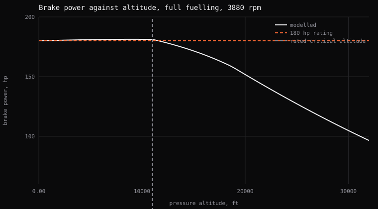
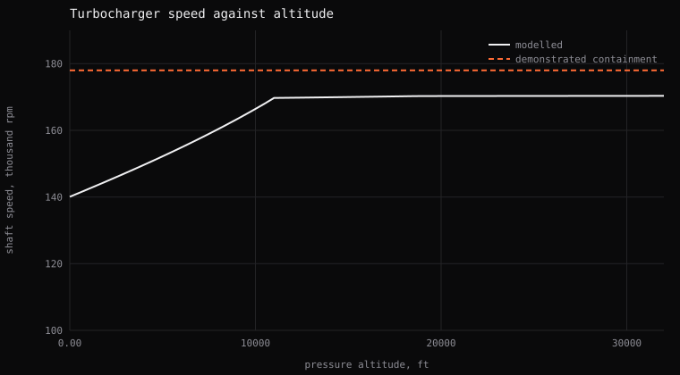
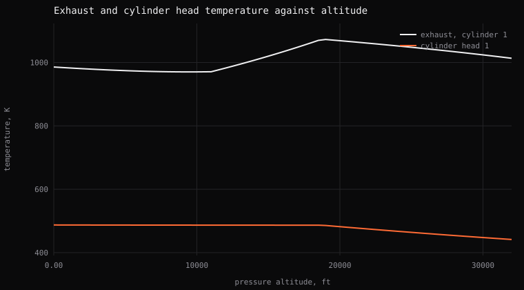
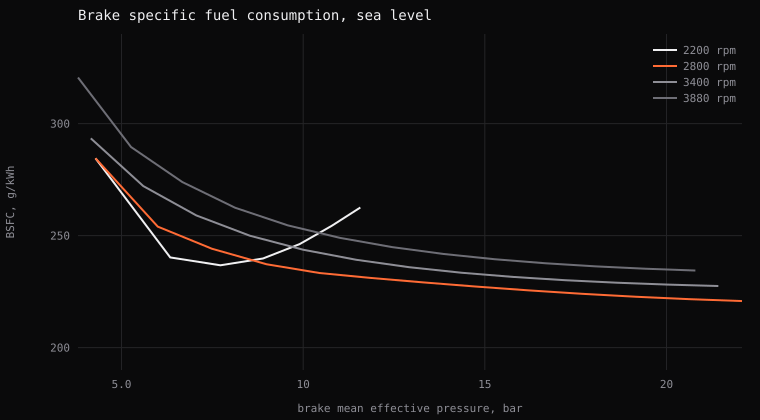
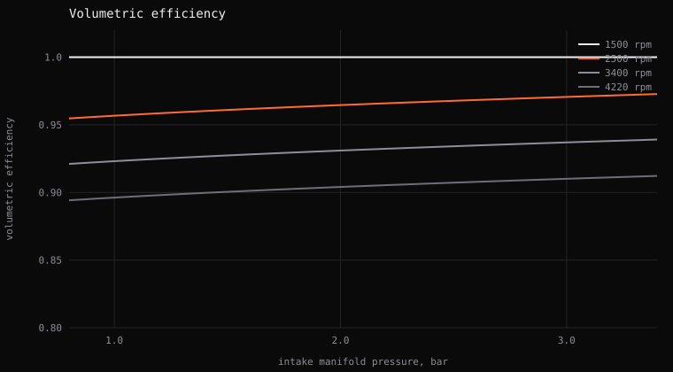
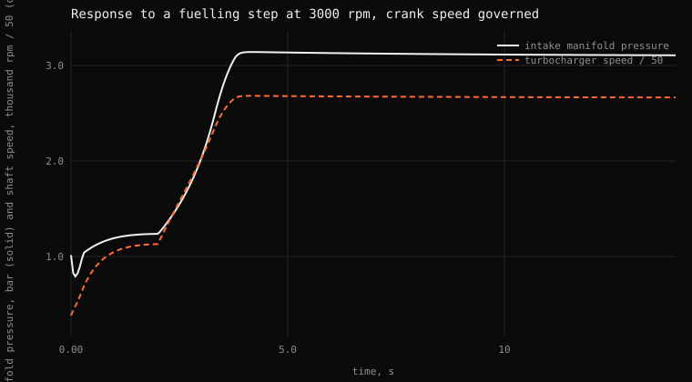

# Model validation

This page checks the engine model against the engine's published figures. `just validate` generates every chart and number on it by running the model, so nothing here is typed by hand: re-run it to change it.

Engine: Austro Engine E4P (AE330), 180 hp heavy-fuel aero diesel. Every parameter lives in `crates/engine-model/src/engines/ae330.toml` and is tagged `published` or `estimated`.

## 1. Power against altitude

The engine is rated at 180 hp for take-off and certified to 20,000 ft. No critical altitude is published, so the turbocharger is sized to hold rated power to 11,000 ft, an `estimated` figure. The sweep continues to 32,000 ft, the medium-altitude long-endurance (MALE) mission envelope, and everything above the certified ceiling is extrapolation.

Modelled: **180.0 hp held from sea level to 11,000 ft**, falling to **96.5 hp at 32,000 ft**.

## 2. Why power falls off above 11,000 ft

A bend in a power curve proves nothing on its own, so this chart shows the mechanism behind it.

Below the critical altitude, the wastegate modulates to hold the manifold pressure set-point, and shaft speed climbs as the compressor works against thinner air. At 11,000 ft the shaft reaches the speed limit the controller enforces, so the wastegate reopens to protect it, and the power plateau ends. The knee isn't a parameter: it's where compressor sizing meets the shaft speed limit, and moving it means resizing the compressor.

Containment is demonstrated to 178,000 rpm for this turbocharger, and the model stays below that across the envelope.

## 3. Temperatures across the envelope

Exhaust gas temperature (EGT) rises above the critical altitude, which is correct. As boost falls, the excess air ratio falls with it, so a smoke-limited engine at altitude runs hotter than the same engine at sea level. Cylinder head temperature (CHT) falls, because it tracks fuel energy and the engine is making less power.

## 4. Brake specific fuel consumption

Brake specific fuel consumption (BSFC) is drawn as one curve per engine speed instead of a filled contour. The information is the same, and the generator needs no plotting dependency.

## 5. Volumetric efficiency

Volumetric efficiency uses a three-coefficient formula instead of a lookup table, so each coefficient can be argued about instead of a surface fitted to data this engine doesn't have. The formula is fitted over the cruise to take-off band and clamped below 1500 rpm, where it would otherwise extrapolate past 1.

## 6. Turbocharger response

Crank speed is governed, so the remaining dynamics are manifold filling and the turbocharger shaft, and this trace shows the spool itself. After a step from 30% to full fuelling at 3000 rpm, the boost rise reaches 90% in **1.65 s**.

## 7. Reference operating points

The table lists four settled operating points. MAP is manifold absolute pressure, and ISA+30 is a day 30 K hotter than the International Standard Atmosphere.

| point | power, hp | prop torque, N.m | MAP, bar | turbo, rpm | lambda | fuel, L/h | EGT, K | CHT, K | coolant, K | oil, bar |
| --- | --- | --- | --- | --- | --- | --- | --- | --- | --- | --- |
| sea level, take-off | 180.0 | 557 | 3.100 | 140082 | 1.562 | 39.3 | 986 | 487 | 361 | 4.44 |
| 11,000 ft, full | 181.2 | 560 | 3.101 | 169722 | 1.602 | 39.3 | 971 | 487 | 361 | 4.53 |
| 22,400 ft, cruise | 63.2 | 204 | 1.360 | 125521 | 2.013 | 15.1 | 760 | 408 | 358 | 4.46 |
| sea level, ISA+30 climb | 171.1 | 529 | 3.100 | 151346 | 1.414 | 39.3 | 1070 | 502 | 376 | 2.05 |

The hot day at sea level is this engine's worst cooling case, even though intuition points to altitude. Cooling is liquid, so radiator air mass flow goes as `m * rho * V`, and at constant indicated airspeed the true airspeed rises as density falls. That product scales with the square root of density: at 25,000 ft it's about two thirds of the sea-level value, against a temperature difference nearly two thirds larger, while the heat to reject has fallen with the engine's power. Cooling binds hot, low, slow and at full power.

## What this validation establishes and what it doesn't

The model establishes three things:

- It reproduces the published take-off point on power, propeller torque and fuel flow together, from a fit to that point alone
- It holds rated power to 11,000 ft through a mechanism you can point at in section 2
- It stays physical across the whole certified envelope

Part-load and altitude behaviour can't be checked, because no measurement is published for this engine. The parameters tagged `estimated` are chosen from the engine class and fitted to the one published point: they're plausible, not measured, and the parameter file says so for each one.

